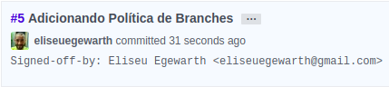

# Política de uso de repositório  

### Política de Issues

As *issues* devem possuir título, descrição, no mínimo um assinante responsável pela execução, *labels* indicando o grupo a quem se destina, a tarefa e *milestone* e *estimated* para as *issues* pontuadas e informar a *sprint* que ela deve ser concluída.

As Labels usadas no projeto estão descritas no tópico [Labels](https://github.com/fga-gpp-mds/AGR-APP-react-native/labels) no Github.

Para criação de issue o [template Issue](docs/ISSUE_TEMPLATE.md) deve ser seguido.

### Política de Branches  

#### *master*

A branch *master* é a branch de produção, onde ficará a versão estável do projeto. Ela estará bloqueada para commits e para pushs.
Veja a política de merges no tópico [Merges para *master*](CONTRIBUTING.md#merges-para-master).

#### *development*

A branch *development* é a branch de desenvolvimento, onde o trabalho das outras branchs será unificado e onde será criada uma versão estável para mesclar com a *master*.
Assim como a *master* ela está bloqueada para commits e pushs.
Veja a política de merges no tópico [Merges para development](CONTRIBUTING.md#merges-para-development)
merges para *development*</a> .

#### Nome das Branches  

##### X_descricao_da_issue

As branchs de desenvolvimento de features serão criadas a partir da branch *development* com a nomenclatura padrão “X_descricao_da_issue”.

Em casos de issues de features de produção, o nome da  branch deve ser “X_nome_da_issue”.

X representa o código de rastreio da issue.
Para criar a branch, vá para a *development*:

```
git checkout development
```

Depois é só criar a branch e está pronto para produzir!

```
git checkout -b X_nome_da_issue
```

### Política de Commits

Todos os commits devem ser feitos usando o parâmetro `-s` para indicar sua assinatura no commit.

```
git commit -s
```

A issue em questão deve ser citada no commit, para isso, basta adicionar `#<numero_da_issue ao commit>`.

```
git commit -sm"#5 Fazendo guia de contribuição"
```



** \*\*Por padrão, o caracter `#` define uma linha de comentário no arquivo da mensagem do commit. Para resolver este problema, use o commando:**
```
git config --local core.commentChar '!'
```

<p align="justify">Para commits em dupla deve ser usado o comando `-s` igualmente, e deve ser adicionado a assinatura da sua dupla.

```
git commit -s
```
Comentário do commit:
```
#5 Fazendo guia de contribuição

Signed-off-by: João Henrique Egewarth <egewarth@gmail.com>
Signed-off-by: Eliseu Egewarth <eliseuegewarth@gmail.com>
```


Para commits que encerram a resolução de uma issue, deve-se iniciar a mensagem do commit com `Fix #<numero_da_issue ao commit>`, para que a issue seja [encerrada automaticamente](https://help.github.com/articles/closing-issues-using-keywords/) quando mesclada na `master`.

Exemplo do comentário do commit:
```
git commit -sm"Fix #5 Finalizando guia de contribuição do projeto"
```

### Política de Merges e Pull Requests

#### Pull Requests

Os pull requests externos devem ser feitos apenas para a branch development seguindo as regras e os passos do tópico Merges para development. No conteúdo do pull request deve haver uma descrição clara do que foi feito.

Para a equipe interna, os pull requests seram realizados em duas situações, para *development* e para *master* seguindo as regras e passos de merge para ambas branchs.

Para ambos os casos deve ser seguido o [template Pull Request](docs/PULL_REQUEST_TEMPLATE.md).

##### Work in Progress

Caso haja a necessidade de atualizar a branch development antes de concluir a issue, o nome do pull request deve conter WIP:<X_nome_da_branch> para que a branch não seja deletada.

#### Merges para development
Os merges para development deverão ser feitos quando a funcionalidade ou refatoração estiverem de acordo com os seguintes aspectos:  
- Funcionalidade ou refatoração concluída;
- *Build* do Travis passando;
- Testes feitos;
- Funcionalidade revisada por algum outro membro.

Para fazer um merge para *development* os passos a serem seguidos são:  
- `git checkout branch_de_trabalho`;
- `git pull --rebase origin development`;
- `git push origin branch_de_trabalho`;
- Abrir pull request via interface GitHub;
- Aguardar Code Review

#### Merges para *master*
Os merges para *master* deveram ser feitos apenas após o término da sprint, quando todas as funcionalidades estiverem entregues. O merge deve ser feito a partir da *development* e apenas quando atingir os seguintes critérios:

- Build Travis passando;
- Sprint dada como concluída.  

##### Code Review
O code review deve ser feito por um ou mais membros da equipe que não participaram das modificações.
Após pelo menos uma aprovação de Code Review, Status Check (Travis, CodeClimate) o PullRequest poderá ser aceito;
