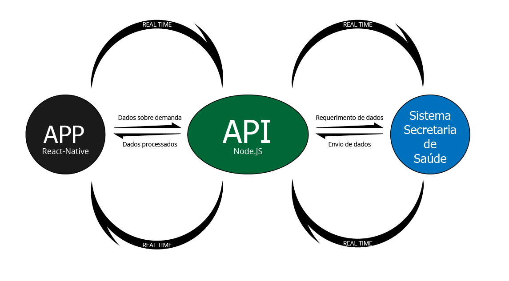
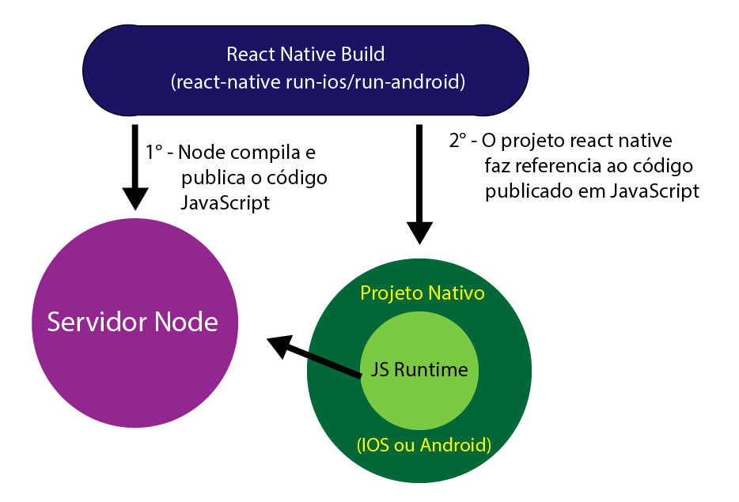
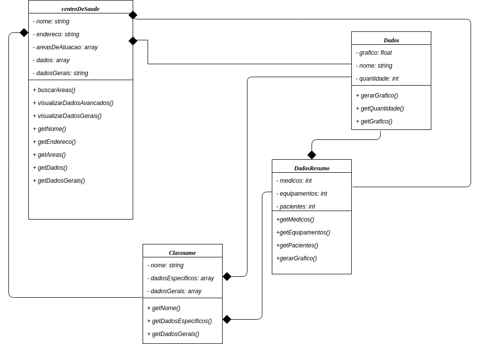

# Documento de Arquitetura

### Sumário
<ul>
<li><a href="#Introdução">Introdução</a></li>
<li><a href="#Finalidade">Finalidade</a></li>
<li><a href="#Escopo">Escopo</a></li>
<li><a href="#Definições">Definições, Acrônimos e abreviações</a></li>
<li><a href="#Referências">Referências</a></li>
<li><a href="#Visão">Visão Geral</a></li>
<li><a href="#Representação">Representação da Arquitetura</a></li>
<li><a href="#Metas">Metas Restrições de Arquitetura</a></li>
<li><a href="#Implementação">Visão de implementação</a></li>
<li><a href="#Referencia">Referências</a></li>
</ul>

 

## 1. Introdução

### 1.1 Finalidade

  

      O documento de arquitetura tem a função de específicar decisões arquiteturais relevantes na produção e implementação do projeto AGR, produzido em react native, descrevendo seus aspectos e funcionalidades do sistema de forma clara e objetiva.
  

### 1.2 Escopo

  

      Este documento se aplica à produção do aplicativo AGR, implementado nas plataformas IOS e Android, representando a arquitetura utilizada.
  

### 1.3 Definições, Acrônimos e abreviações

  

    Este são alguns dos termos e abreviações ultilizados no projeto:
  

* MDS = "Métodos de Desenvolvimento de Software";
* EPS = "Engenharia de Produtos de Software";
* API = "Application Programming Interface" ou Interface de Programação de Aplicativos;

### 1.4 Referências

* <a href= "https:///github.com/fga-gpp-mds/AGR-APP-react-native/blob/master/docs/visao.md"> Documento de Visão;</a>

### 1.5 Visão Geral

  

    Este documento é estruturado da seguinte forma:
  

* <b>Introdução:</b> Visualização da composição basica do documento de arquitetura;

* <b>Representação da Arquitetura:</b> Noções básicas da forma da arquitetura do projeto em relação a API e o banco de dados;

* <b>Metas e Restrições de Arquitetura:</b> Descrição dos objetivos do software de grande importancia e as restrições encontradas no desenvolvimento;

* <b>Visão de implementação:</b> Descreve de forma geral a implementação e como as classes devem se comportar por meio do diagrama de classes.

## 2. Representação da Arquitetura

  

    
    

  

    
  

## 3. Metas Restrições de Arquitetura

  

    Para o desenvolvimento deste projeto serão ultilizadas as seguintes tecnologias:
  

* <a href ="https://facebook.github.io/react-native/"> React-native</a>: Utilizado para a construção do aplicativo em IOS e Android;

* <a href ="https://nodejs.org/en/">Node.js</a>: Plataforma de desenvolvimento da API;

* Base de dados fornecida pela <a href ="http://www.saude.df.gov.br/index.php">Secretaria de Saúde</a>;

* Manutenibilidade: O código deve ser facilmente modificado e corrigido;

## 4. Visão de Implementação
* #### Diagrama de Classes

  

    
  

## 5. Referências

  

    Secretaria de Estado de Saúde do Distrito Federal, http://www.saude.df.gov.br/index.php Acesso em: 23/03/2018, 11:36, Horário de Brasília.
  

  

    React-native, https://facebook.github.io/react-native/ Acesso em: 23/03/2018, 11:20, Horário de Brasília.
  

  

    Node.js, https://nodejs.org/en/ Acesso em: 23/03/2018, 11:56, Horário de Brasília.
  

  

    React Native Architecture: Explained! https://www.logicroom.co/react-native-architecture-explained/ Acesso em: 22/03/2018, 12:05, Horário de Brasília.
  

