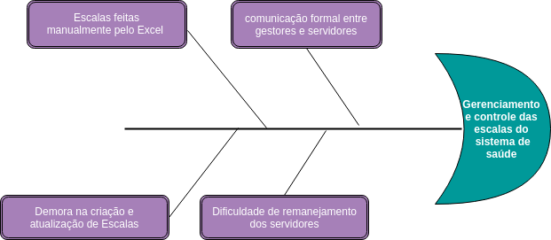

<h3> Sumário</h3>

<ul>
 <li><a href="#1">1. Introdução</li>
 <li><a href="#1.1">1.1 Propósito</li>
 <li><a href="#1.2">1.2 Escopo</li>
 <li><a href="#1.3">1.3 Visão Geral do Documento</li>
</ul>

<ul>
  <li><a href="#2">2. Posicionamento</li>
  <li><a href="#2.1">2.1 Oportunidade de negócio</li>
  <li><a href="#2.2">2.2 Instrução do Problema</li>
  <li><a href="#2.3">2.3 Instrução de Posição do Produto</li>
</ul>

<ul>
  <li><a href="#3">3. Visão Geral do Produto</li>
  <li><a href="#3.1">3.1 Escopo do Produto</li>
  <li><a href="#3.2">3.2 Propósito do produto</li>
  <li><a href="#3.3">3.3 Recursos do produto</li>
</ul>

<ul>
  <li><a href="#4">4. Visão Geral do Produto</li>
  <li><a href="#4.1">4.1 Perfis das Partes Interessadas</li>
  <li><a href="#4.2">4.2 Perfis do Usuário</li>
</ul>

<ul>
  <li><a href="#5">5. Restrições </li>
</ul>

<ul>
  <li><a href="#6">6. Referências </li>
</ul>

 

<h3> 1. Introdução</h3>

<h5> 1.1 Propósito:</h5>

Este artefato apresenta as justificativas para o desenvolvimento da aplicação mobile  Dulce (<strong>D</strong>ispositivo <strong>U</strong>nificado de Co<strong>l</strong>aboração para <strong>C</strong>onstrução de <strong>E</strong>scala) auxiliando na compreensão do contexto em que a aplicação está inserida, assim como os objetivos e metas que a equipe das disciplinas de Métodos de Desenvolvimento de Software e Engenharia do Produto de Software procuram alcançar com o desenvolvimento deste sistema. Além destas descrições do sistema, serão apresentados esquemas e diagramas que garantem a visibilidade do funcionamento e de certas características do sistema para a equipe, permitindo que os mesmos possam trabalhar de uma maneira produtiva e sincronizada. 
      

<h5> 1.2 Escopo:</h5>

  
O Documento de Visão tem o objetivo de informar aos envolvidos a problematização a ser resolvida e as funcionalidades do produto que serão atendidas pelo projeto Dulce. Tendo em vista que este documento será atualizado durante a produção do aplicativo.

  

  

<h5> 1.3 Visão Geral do Documento:</h5>

  
O conteúdo deste documento está organizado de forma a fornecer uma visão dos envolvidos no projeto, das necessidades apontadas, dos benefícios esperados, e das funcionalidades e suas características para atender a estes benefícios. Também são apresentados aqui requisitos importantes para o produto, sem detalhar cada funcionalidade do sistema, visto que esta atividade será realizada na especificação dos casos de uso. 

  

<h3> 2. Posicionamento</h3>

<h5> 2.1 Oportunidade de negócio:</h5>

  
 Com a implantação do Dulce, as áreas de gestão de pessoal na Secretaria de Saúde do DF tenderão a se tornar mais eficientes. Dulce será um aplicativo voltado para gestão e gerenciamento de escalas. Com a implementação de Dulce a saúde pública tende a ter uma grande melhoria em sua gestão, principalmente na relação entre o gestor e os funcionários de um determinado setor, ganhando agilidade para criar e remanejar escalas.  

<h5> 2.2 Instrução do Problema:</h5>

  
A Secretaria de Saúde do DF enfrenta dificuldades no gerenciamento do pessoal dos hospitais públicos.
  

  
As escalas dos setores dos hospitais são feitas manualmente no Excel e colocadas mensalmente no Software TrakCare, onde os profissionais podem visualizar a própria escala e colocar as consultas/trabalhos realizados. Além do TrakCare, há também o sistema de ponto eletrônico, em que os servidores o utilizam a fim de marcar presença.
  

  

  Esses dois sistemas são independentes, e muitas vezes as informações entre os dois não coincidem.
  

  <table border="1">
    <tr>
      <td><b>Tipo</b></td>
      <td><b>Descrição</b></td>
    </tr>
    <tr>
      <td>Problema</td>
      <td>
        A dificuldade na gestão de pessoal e no gerenciamento das escalas
      </td>
    </tr>
    <tr>
      <td>Afeta</td>
      <td>
        Recursos financeiros, profissionais da área, população em geral
      </td>
    </tr>
    <tr>
      <td>Impacto</td>
      <td>
        Alocação e remanejamento de profissionais no sistema de saúde requer muito trabalho manual
      </td>
    </tr>
    <tr>
      <td>Solução</td>
      <td>
        Aplicativo Dulce para  aprimorar o gerenciamento das escalas dos profissionais do SES-DF
      </td>
    </tr>
  </table>

 

<h6> Diagrama de Fishbone</h6>

  

  

<h5> 2.3 Instrução de Posição do Produto:</h5>

  
 Dulce é um aplicativo que oferecerá suporte aos gestores do hospital, para terem maior controle sobre as escalas e o remanejamento de pessoal. Além disso, o funcionario poderá consultar sua escala, pedir alteração ou remanejamento, e se for preciso, enviar para o gestor do seu devido setor um atestado nos casos de problemas de saúde, tudo isso por meio do dispositivo móvel.

<h3> 3. Visão Geral do Produto </h3>

<h5> 3.1 Escopo do produto:</h5>

  
A Secretaria de Saúde do DF apresenta deficiências no gerenciamento de escalas, o que pode afetar a qualidade do sistema. O Dulce será utilizado para documentar as escalas planejadas e as realizadas, agindo como um sistema de auditoria com o objetivo de fornecer informações relevantes aos gestores para uma melhor organização e gerenciamento das escalas montadas para seus funcionários.

<h5>3.2 Propósito do produto:</h5>

  
Dulce tem o propósito de auxiliar a gestão no sistema de saúde do DF, promovendo uma interface entre gestor e pessoal de um determinado setor, auxiliando os gestores a criar escalas dos servidores do seu setor, facilitando também o remanejamento de escalas, e aos funcionários, seu controle de ponto.

<h5>3.3 Recursos do produto:</h5>

O principal recurso ou funcionalidade do produto é auxiliar na montagem de escalas de funcionários, auxiliando assim aos gestores, que terão uma maior facilidade para monitorar os horários que estão sendo cumpridos, e aos funcionários que poderão interagir mais com sua escala designada, podendo visualizar, pedir alteração e até enviar atestados.

<h3> 4. Descrição das Partes Envolvidas</h3>

<h5> 4.1 Perfis das Partes Interessadas:</h5>

<dl>
   <dt>Cliente:</dt>
   <dd>O cliente é o idealizador do projeto.</dd>

   <dt>Usuários:</dt>
   <dd>Funcionários da Secretaria de Saúde do DF.</dd>
   
   <dt>Equipe:</dt>
   <dd>A equipe é composta por graduandos em Engenharia de Software pela Universidade de Brasília, Campus Gama, discentes das disciplinas de Engenharia de Produto de Software e Métodos de Desenvolvimento de Software.</dd>

</dl>

<a href="https://github.com/fga-gpp-mds/agr-react-native/blob/master/docs/equipe.md">Documento de Equipe</a>

<h5>4.2 Perfis do Usuário:</h5>

Os Usuários serão os gestores dos setores do hospital e os servidores da saúde, como, médicos, fisioterapeutas e enfermeiros, que trabalham no hospital.

<h5> 4.3 Alternativas e Concorrência</h5>
<ul>
 <li><h6>TrakCare</h6></li>
  <ul>
    <li>
      O sistema eletrônico atual da Secretaria de Saúde do DF. O qual reúne todos os dados de consultas, alergias, exames e histórico médico da rede pública de saúde do Distrito Federal.
    </li>
     
    
  </ul>
   
  <li><h6>Mobi Saúde</h6></li>
  <ul>
    <li>
      É um aplicativo que facilita a administração hospitalar e de unidades de saúde, controlando a escala de funcionários e agilizando a comunicação com o corpo clínico.
    </li>
     
    
  </ul>
   
  <li><h6>ERP Radar Empresarial</h6></li>
  <ul>
    <li>
      É um software integrado para gestão de empresas. Ele busca cobrir todas as áreas gerenciáveis de empresa: vendas, finanças, materiais, produção, custos, serviços, controladoria, RH, GED, BI e qualidade, adaptável às necessidades e à realidade de empresas de todos os portes e segmentos.
    </li>
     
    
  </ul>
   
  <li><h6>ContaAzul</h6></li>
  <ul>
    <li>
      É um software feito para realização de toda a gestão de um negócio com um único sistema de controle financeiro, com uma visão de relatórios em tempo real, das contas a vencer à situação do fluxo de caixa; com controle de estoque de produtos, facilita a elaboração de relatórios gerenciais
    </li>
     
     
  </ul>
   
  <li><h6>Gestão Plus</h6></li>
  <ul>
    <li>
      Este software de gestão facilita a organização de informações fiscais e contábeis, além dos dados relativos aos clientes e às vendas, cadastro de produtos etc.
    </li>
     
    
  </ul>
     
</ul>

<h3>5. Restrições:</h3>

  <ul>
    <li> O sistema necessita de informações que serão fornecidas pela    SES-DF;</li>
    <li>O sistema deverá estar acessível até julho de 2018;</li>
    <li> O sistema deverá funcionar tanto em Android como em iOS;</li>
  </ul>

<h3>6. Referências:</h3>

  

    Vision – Scaled Agile Framework, https://www.scaledagileframework.com/vision/ Acesso em: 19/03/2018, 21:10, Horário de Brasília.
  

  

    O Globo Saúde Pública do país sofre de má gestão, https://oglobo.globo.com/opiniao/saude-publica-do-pais-sofre-de-ma-gestao-12010246 Acesso em: 20/03/2018, 20:09, Horário de Brasília.
  

  

    Secretaria de Estado de Saúde do Distrito Federal, http://www.saude.df.gov.br/component/content/article/254-sobre-a-secretaria/772-transparencia-na-saude.html Acesso em: 20/03/2018, 20:16, Horário de Brasília.
  

  

    Projeto Receituário Médico - Documento de visão, https://github.com/fga-gpp-mds/2017.2-Receituario-Medico Acesso em: 20/03/2018, 20:54, Horário de Brasília.
  

  

    Radar Empresarial Segurança nos processos, https://www.wk.com.br/solucoes/erp Acesso em: 22/03/2018, 17:30, Horário de Brasília.
  

  

    Aplicativo de gestao Hospitalar, https://g1.globo.com/bemestar/noticia/aplicativo-de-gestao-hospitalar-monitora-equipe-medica-e-promete-reduzir-custos.ghtml Acesso em: 22/03/2018, 18:50, Horário de Brasília.
  

  

    TrakCare Sistema de informação em Saude, http://www.intersystems.com/br/produtos/trakcare/trakcare-overview-2/ Acesso em: 22/03/2018, 20:54, Horário de Brasília.
  

