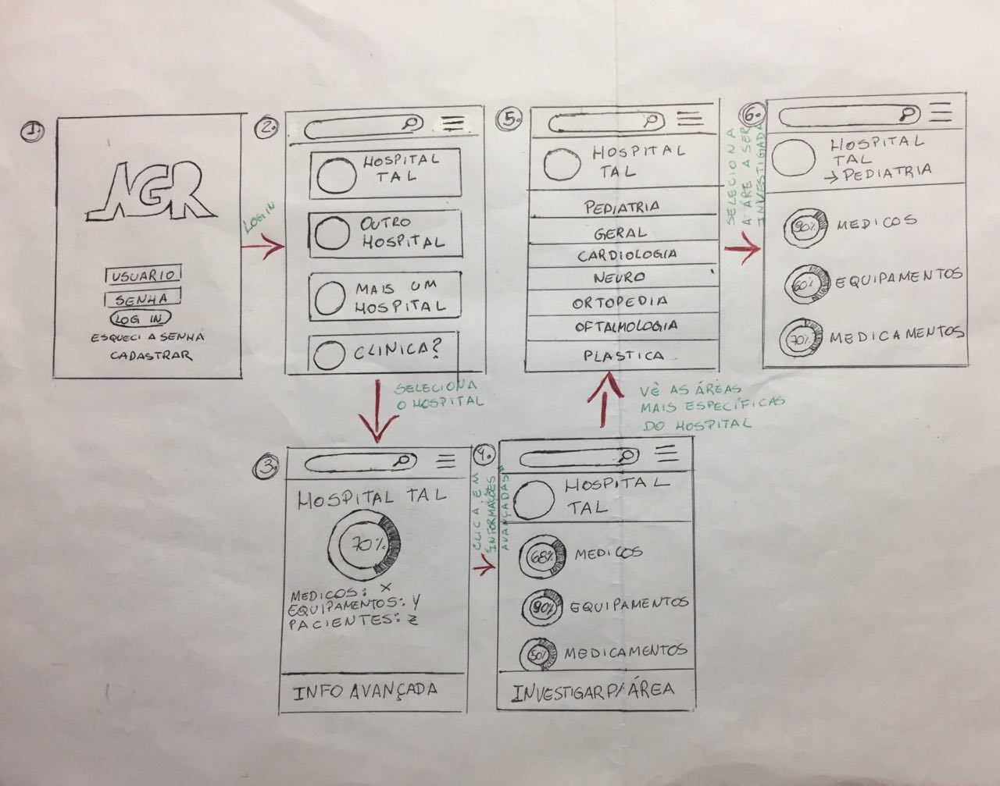

# Protótipo de Baixa Fidelidade

  
O documento possui o objetivo de apresentar o protótipo de baixa fidelidade do aplicativo referente ao projeto AGR. Inicialmente foi considerado o login e a análise de dados sobre a escala de profissionais, equipamentos e medicamentos disponíveis no hospital selecionado para os gestores da área da saúde acessarem. 

A ordem indica o caminho a ser seguido pelo usuário conseguir examinar cada informação do setor desejado.

  

Telas:

  
<ol>
     <li> 1. Tela inicial para entrar no software ou realizar um novo cadastro de usuário;</li>

     <li> 2. Aparece as opções de hospitais disponíveis da SES-DF;</li>

     <li> 3. Selecionado um hospital específico, apresenta-se um gráfico com porcentagem dos elementos: profissionais, materiais e medicamentos;</li>

     <li> 4. Após selecionar "Info Avançadas", a tela apresentará outros gráficos, com maiores detalhes para cada elemento desejado de análise;</li>

     <li> 5. Em seguida, ao clicar em "Investigar por área", o usuário encontrará uma lista de setores  saúde;</li>

     <li>6. Ao escolher um dos setores, aparecerá outros gráficos com informações somente da seção selecionada.</li>
  </ol>

  

